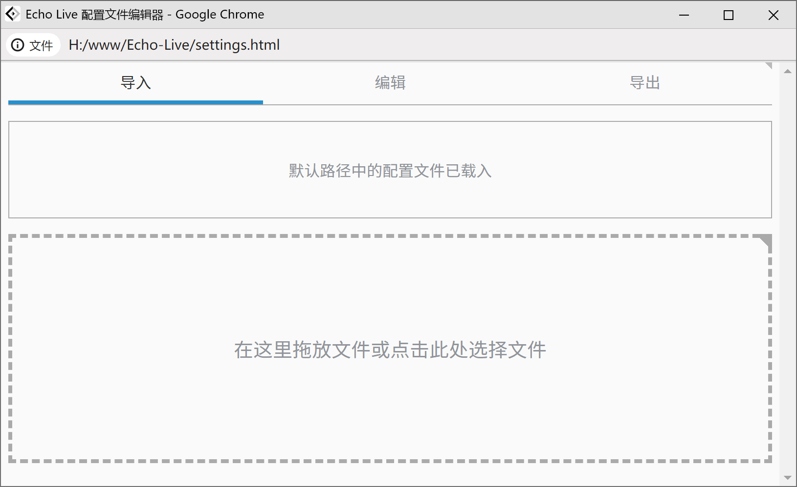

# 配置

`config.json` 是配置文件，可以在这里更改配置。更改配置后，需要刷新页面才能生效。

## :material-cog-box: 使用配置文件编辑器 { id="config-editor" }

    :material-tag:
    1.3.0

`settings.html` 是配置文件编辑器，直接在浏览器中打开即可使用。通常情况下，配置文件编辑器会自动读取默认位置的配置文件。

由于配置文件编辑器使用了一些最新技术，建议您使用最新版 Chrome 或 Edge 浏览器打开。

### :material-import: 导入配置文件

选择 “导入” 标签页，将配置文件拖入页面中的虚线框内或点击虚线框内即可导入配置文件。

如果导入的配置文件正确，您有可能会遇到以下提示：

- 无法安全读取 —— 这通常是因为配置文件来自于早期版本。如果您认为您的配置文件没有问题，并且没有被植入恶意代码的可能，可以点击 “不安全读取” 继续。
- 需要升级 —— 配置文件来自旧版本，需要升级才能使用。

当您解决了以上问题，或是没有遇到任何问题，配置文件便已成功导入了。接下来，切换到 “编辑” 标签页即可编辑配置文件。

### :material-pencil: 编辑配置文件

在 “编辑” 标签页中，您可以编辑所有配置文件项目。

当您更改了一项配置时，底部会出现三个按钮：

- 撤销 —— 撤销所有更改。
- 暂存 —— 保存更改，但不导出文件。
- 保存 —— 保存更改，立即导出文件。如果您的浏览器支持某项新技术（具体表现为弹出系统对话框选择文件保存位置），在完成一次导出后，再次点击保存按钮可以直接写入文件而不再弹窗。

### :material-export: 导出配置文件

在 “导出” 标签页中，您可以导出配置文件。

此页面中列出了最终会写入配置文件的内容，您可以在此直接修改。如果您搞砸了，点击 “重新导出” 按钮即可重新导出配置文件内容。

点击 “保存” 按钮时：

- 如果您的浏览器支持某项新技术，将会弹出系统对话框选择文件保存位置。如果您没有特殊需要，建议您将文件保存在 Echo-Live 根目录处以覆盖配置文件，之后再点击 “保存” 按钮时将会直接写入文件。
- 如果您的浏览器不支持，将会直接下载文件，请您自行将文件移动到正确位置。

“另存为” 按钮和 “保存” 按钮唯一的区别是 “另存为” 按钮无论如何都会弹出系统对话框选择文件保存位置。

## :material-format-list-bulleted: 配置列表

### :material-earth: 全局配置
前缀：`global.`

| 配置项 | 预设值 | 描述 |
| - | - | - |
| `language` | "zho-Hans" | 显示语言。可用的配置值见[语言列表](language.md#list)。 |
| `theme` | "vanilla" | 全局主题，控制前台页面的主题。可用的主题请见[主题列表](theme.md#theme-list)。 |
| `theme_script_enable` | false | 启用全局主题脚本。 |
| `color_scheme` | "auto" | 后台页面配色方案，可选择 `auto`（跟随系统）、`light`（浅色）和 `dark`（深色）。 |

### :material-code-braces-box: Echo 相关配置
前缀：`echo.`

| 配置项 | 预设值 | 描述 |
| - | - | - |
| `print_speed` | 30 | 滚动速度，每个字符打印循环的延迟时间（毫秒），最小值为 4。 |
| `html_format_enable` | true | 启用 HTML 过滤器。启用后，HTML 语义元素会被转义。 |

### :material-message-text: Echo Live 相关配置
#### 主题样式
前缀：`echolive.style.`

| 配置项 | 预设值 | 描述 |
| - | - | - |
| `live_theme` | "" | 对话框主题，留空则使用全局主题。可用的主题请见[主题列表](theme.md#theme-list)。 |
| `live_theme_script_enable` | false | 启用主题脚本。 |

#### 广播
前缀：`echolive.broadcast.`

| 配置项 | 预设值 | 描述 |
| - | - | - |
| `enable` | true | 启用广播，可通过编辑器直接发送消息，启用此项将禁用消息轮询。 |
| `channel` | "sheep-realms:echolive" | 广播频道名称。 |
| `websocket_enable` | false | 启用 WebSocket。广播模式下启用 WebSocket 可连接至服务器以从第三方软件获取消息。 |
| `websocket_url` | "ws://127.0.0.1:3000" | WebSocket 连接地址。 |
| `websocket_reconnect_limit` | 5 | WebSocket 最大重连尝试次数。 |
| `experimental_api_enable` | false | 启用实验性 API。 |

#### 消息轮询
前缀：`echolive.messages_polling.`

| 配置项 | 预设值 | 描述 |
| - | - | - |
| `enable` | true | 启用消息轮询，无需手动刷新，关闭则使用旧版手动操作。 |
| `tick` | 250 | 消息轮询间隔（毫秒），值越小响应越快，性能消耗越高。 |

#### 休眠机制
前缀：`echolive.sleep.`

| 配置项 | 预设值 | 描述 |
| - | - | - |
| `enable` | true | 启用休眠机制，当页面不可见时休眠以防止计时器失效所引发的灾难性演出。 |
| `during_printing_stop_print` | true | 在打印期间休眠立即停止打印。 |

#### 打字音效
前缀：`echolive.print_audio.`

| 配置项 | 预设值 | 描述 |
| - | - | - |
| `enable` | false | 启用打字音效，`false` 为禁用，`true` 为启用。 |
| `name` | "typewriter_loop" | 音效名称，详见[音效列表](sound.md#list)。 |
| `volume` | 0.5 | 音效音量，`1` 为最大。 |
| `rate` | 1 | 音效播放速度，`1` 为原速。 |

#### 新对话入场音效
前缀：`echolive.next_audio.`

| 配置项 | 预设值 | 描述 |
| - | - | - |
| `enable` | false | 启用新对话入场音效，`false` 为禁用，`true` 为启用。 |
| `name` | "enter" | 音效名称，详见[音效列表](sound.md#list)。 |
| `volume` | 0.5 | 音效音量，`1` 为最大。 |
| `rate` | 1 | 音效播放速度，`1` 为原速。 |

#### 隐去与显现动画
前缀：`echolive.display.`

| 配置项 | 预设值 | 描述 |
| - | - | - |
| `auto` | false | 闲置时是否自动隐去。 |
| `hidden_wait_time` | 20000 | 闲置等候时间，单位毫秒。 |
| `long_text_compensation_rate` | 0.15 | 长文本等候时间补偿率。当消息文本过长时会额外补偿一些等候时间，设为 0 则禁用。 |
| `hidden_time` | 1000 | 隐去动画用时，单位毫秒。 |
| `show_time` | 500 | 显现动画用时，单位毫秒。 |

#### 讲述人
前缀：`echolive.speech_synthesis.`

| 配置项 | 预设值 | 描述 |
| - | - | - |
| `enable` | false | 启用讲述人。 |
| `voice` | "" | 语音资源，留空则使用系统默认值。 |
| `pitch` | 1 | 音高，`1` 为基准。 |
| `rate` | 1 | 语速，`1` 为原速。 |
| `delay` | 0 | 延迟，单位毫秒。 |
| `speech_emoji` | false | 读出表情符号。 |
| `ignored_characters` | "" | 忽略的字符。 |

### :material-pencil-circle: 编辑器相关配置
#### 功能
前缀：`editor.function.`

| 配置项 | 预设值 | 描述 |
| - | - | - |
| `tabpage_config_enable` | true | 显示配置标签页。 |
| `tabpage_output_enable` | true | 显示输出标签页。 |
| `client_state_panel_enable` | false | 显示对话框状态仪表板。 |
| `history_resend_bubble` | false | 历史消息再次发送时是否使历史记录回到顶部。 |
| `history_maximum` | 128 | 历史消息数量上限。设为 `-1` 则不设上限。 |
| `log_line_maximum` | 512 | 日志行数上限。设为 `-1` 则不设上限。 |
| `images_cache_maximum` | 64 | 自定义消息图片缓存数上限。设为 `-1` 则不设上限。 |

#### 表单预填充
前缀：`editor.form.`

| 配置项 | 预设值 | 描述 |
| - | - | - |
| `username` | "" | 初始说话人。 |
| `quote_before` | "「" | 引用符号（开头）。 |
| `quote_after` | "」" | 引用符号（结尾）。 |
| `output_before` | "echolive.send(" | 在输出内容之前插入的内容。 |
| `ontput_before_enable` | 1 | 启用上述功能，`0` 为禁用，`1` 为启用。 |
| `output_after` | ");" | 在输出内容之后插入的内容。 |
| `ontput_after_enable` | 1 | 启用上述功能，`0` 为禁用，`1` 为启用。 |

#### 拾色器
前缀：`editor.color_picker.`

| 配置项 | 预设值 | 描述 |
| - | - | - |
| `palette` | "all" | 拾色器中启用的色板。设为 `all` 视为启用所有可用色板，否则类型为数组，数组元素为字符串，填写需要启用的色板名称，可排序。 |
| `color_contrast_enable` | false | 拾色器是否启用 WCAG 颜色对比度测试面板。 |
| `color_contrast_background_color` | "#ffffff" | 拾色器 WCAG 颜色对比度测试面板参考背景色。仅支持十六进制颜色码，背景色的 Alpha 通道会被忽略。 |
| `color_contrast_threshold` | 3.8 | 拾色器 WCAG 颜色对比度测试面板对比度参考阈值。 |

#### 表情选择器
前缀：`editor.emoji_picker.`

| 配置项 | 预设值 | 描述 |
| - | - | - |
| `emoji` | "all" | 表情选择器中启用的表情包。设为 `all` 视为启用所有可用表情包，否则类型为数组，数组元素为字符串，填写需要启用的表情包名称，可排序。 |

### :material-history: 历史记录相关配置
#### 主题样式
前缀：`echolive.style.`

| 配置项 | 预设值 | 描述 |
| - | - | - |
| `history_theme` | "" | 历史记录主题，留空则使用全局主题。可用的主题请见[主题列表](theme.md#theme-list)。 |
| `history_theme_script_enable` | false | 启用主题脚本。 |

#### 布局
前缀：`echolive.layout.`

| 配置项 | 预设值 | 描述 |
| - | - | - |
| `message_list_reverse` | false | 历史记录倒序排列。 |
| `message_item_reverse` | false | 历史记录布局左右翻转。 |
| `display_username` | true | 显示说话人。 |
| `display_time` | true | 显示发送时间。 |

#### 消息
前缀：`echolive.message.`

| 配置项 | 预设值 | 描述 |
| - | - | - |
| `remove_continuous_duplicate` | true | 去除连续的重复消息。如果场景中有多个对话框同时接收消息，启用此项可避免重复记录历史消息。 |
| `latest_message_hide` | true | 隐藏最新的历史记录。 |

### :material-wheelchair-accessibility: 无障碍相关配置
前缀：`echolive.accessible.`

| 配置项 | 预设值 | 描述 |
| - | - | - |
| `high_contrast` | false | 高对比度。 |
| `high_contrast_outline_color` | "#00E9FF" | 焦点高亮边框颜色。 |
| `high_contrast_outline_size` | "2px" | 焦点高亮边框尺寸。 |
| `high_contrast_outline_style` | "solid" | 焦点高亮边框样式。 |
| `drotanopia_and_deuteranopia` | false | 红绿色盲。 |
| `link_underline` | false | 总是显示链接下划线。 |
| `animation_disable` | false | 禁用动画。 |
| `power_saving_mode` | false | 禁用高开销效果。 |

### :material-cog: 高级设置
除非您知道您在干什么，否则请不要动这里的设置。

前缀：`echolive.advanced.`

| 配置项 | 预设值 | 描述 |
| - | - | - |
| `broadcast.allow_name_duplicate` | false | 允许识别名重复。 |
| `editor.forced_display_split_message` | false | 强制显示 “多行文本分割为消息队列” 选项。 |
| `editor.history_minimum_breaker_threshold` | 128 | 历史记录底部游标熔断阈值。设为 `-1` 可禁用此机制。 |