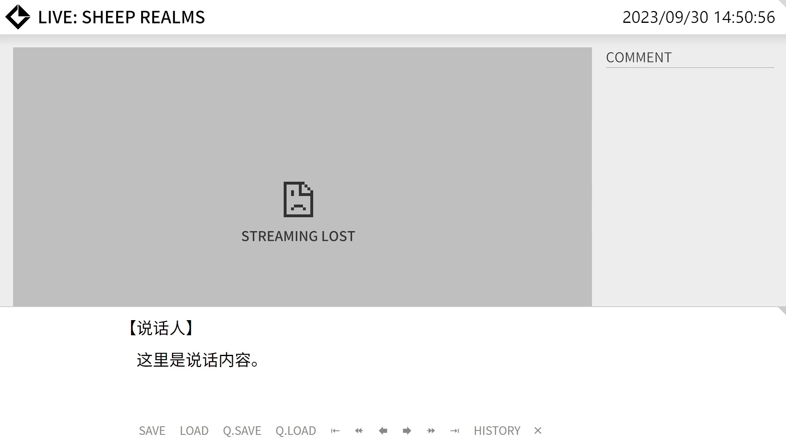
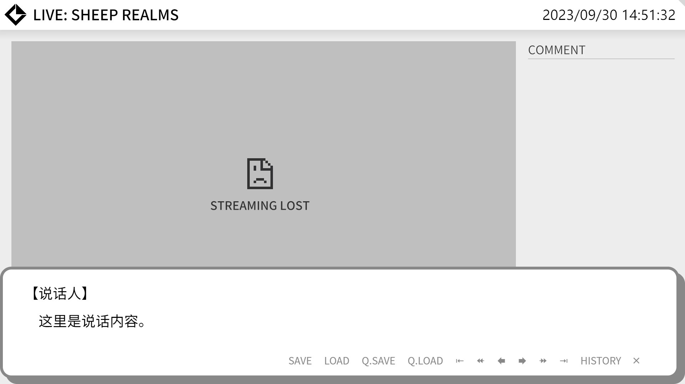

# 关于主题

Echo-Live 内置了多套主题，您可以通过修改配置文件更换主题。

各种主题的样式表文件中都在顶部整理了常用变量，方便您快速修改诸如背景颜色、边框、字体大小等参数。

主题文件使用的是广泛运用的 CSS 样式，如有需要，您可以咨询网页或 UI 设计师定制主题。

## 更换主题
打开[配置文件编辑器](config.md#config-editor)，在 “全局” 选项中找到 “全局主题” 项目，此配置值即为主题的 ID，修改即可更换主题，主题 ID 见下表。

该配置下方还有 “启用全局主题脚本” 配置项，其作用是启用主题附带的脚本。一些高级效果可能需要启动脚本才能生效，目前所有预制主题中均不包含脚本。关于启用脚本可能存在的风险请见[安全须知](../main/security.md)。

以上配置在 “Echo-Live” 和 “历史记录” 中均有独立配置，其中主题脚本需要全局配置和独立配置都启用才能生效。

最后，别忘了保存文件。

## 主题列表 { id="theme-list" }
| :material-tag: ID | :material-format-title: 名称 | :material-help-circle: 描述 | :material-script-text: 脚本 |
| - | - | - | - |
| `vanilla` | 原版 | Echo-Live 的默认主题，几乎没有任何装饰，适用于在画面中以全屏宽度靠下展现。右侧预留了立绘位置，可将立绘覆盖在对话框之上。 | :material-close: 无 |
| `bubble` | 气泡 | 常见的气泡对话框，具有粗边框和投影，可调整成任意尺寸，没有预留立绘位置。 | :material-close: 无 |
| `void` | 虚空 | 无背景对话框，仅显示文字。 | :material-close: 无 |

## 主题预览
### 原版 | Vanilla

{ .theme-review }

### 气泡 | Bubble

{ .theme-review }

## 定制主题

参阅[定制主题](../dev/theme.md)。