# 关于主题

<style>
    .theme-review {
        box-shadow: var(--md-default-fg-color--lightest) 0 0 16px;
    }
</style>

Echo-Live 内置了多套主题，您可以通过修改配置文件更换主题。

各种主题的样式表文件中都在顶部整理了常用变量，方便您快速修改诸如背景颜色、边框、字体大小等参数。

主题文件使用的是广泛运用的 CSS 样式，如有需要，您可以咨询网页或 UI 设计师[定制主题](../dev/theme.md)。

!!! warning "特别提醒"

    为了主题样式的表现正常，请在 OBS 选中对话框（包括历史记录在内的其他前台页面），右键，在弹出菜单中找到 **“混合方式”**，选择 **“关闭 sRGB”**。

## 更换主题
打开[配置文件编辑器](config.md#config-editor)，在 “全局” 选项中找到 “全局主题” 项目，此配置值即为主题的 ID，修改即可更换主题，主题 ID 见下表。

该配置下方还有 “启用全局主题脚本” 配置项，其作用是启用主题附带的脚本。一些高级效果可能需要启动脚本才能生效，目前所有预制主题中均不包含脚本。关于启用脚本可能存在的风险请见[安全须知](../main/security.md)。

以上配置在 “Echo-Live” 和 “历史记录” 中均有独立配置，其中主题脚本需要全局配置和独立配置都启用才能生效。

最后，别忘了保存文件。

### 单独更换主题

如果您不打算更改配置文件，或是想为某个对话框单独设置主题，请见[URL 参数](../reference/url-params.md)。

## 主题列表 { id="theme-list" }

!!! warning "再次提醒"

    为了主题样式的表现正常，请在 OBS 选中对话框（包括历史记录在内的其他前台页面），右键，在弹出菜单中找到 **“混合方式”**，选择 **“关闭 sRGB”**。

| :material-tag: ID | :material-format-title: 名称 | :material-help-circle: 描述 | :material-resize: 建议尺寸 |
| - | - | - | - |
| `vanilla` | 原版 | Echo-Live 的默认主题，几乎没有任何装饰，适用于在画面中以全屏宽度靠下展现。右侧预留了立绘位置，可将立绘覆盖在对话框之上。 | 1920 × 330 像素 |
| `bubble` | 气泡 | 常见的气泡对话框，具有粗边框和投影，可调整成任意尺寸，没有预留立绘位置。 | 随意 |
| `glass` | 玻璃 | GalGame 中常见的渐变背景对话框，适用于在画面中以全屏宽度靠下展现。默认使用深色背景，没有预留立绘位置。 | 1920 × 330 像素 |
| `void` | 虚空 | 无背景对话框，仅显示文字。 | 随意 |

## 主题预览
### 原版 | Vanilla

{ loading=lazy .theme-review }

### 气泡 | Bubble

{ loading=lazy .theme-review }

### 玻璃 | Glass

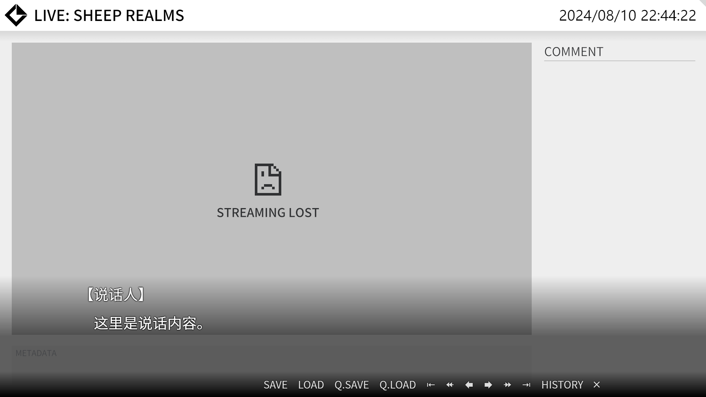{ loading=lazy .theme-review }

### 虚空 | Void

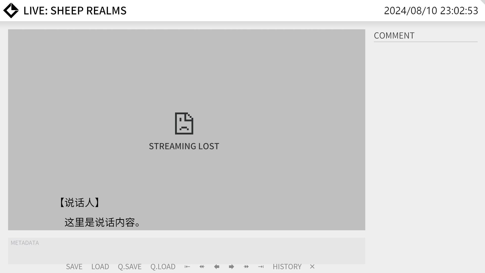{ loading=lazy .theme-review }

## 定制主题

参阅[定制主题](../dev/theme.md)。

## 预制的定制主题

!!! warning "重要的话说三次"

    为了主题样式的表现正常，请在 OBS 选中对话框（包括历史记录在内的其他前台页面），右键，在弹出菜单中找到 **“混合方式”**，选择 **“关闭 sRGB”**。

考虑到很多人在定制主题上遇到的困难，我们准备了一些定制主题的预制，您使用这些预制现在变得十分简单：

1. 在下文中挑选您喜欢的预制，编辑[配置](config.md)更改为对应的主题。如果您想为某个对话框单独设置主题，请见[URL 参数](../reference/url-params.md)。
2. 复制您选中的预制代码。
3. 在 OBS 选中对话框（包括历史记录在内的其他前台页面），右键，在弹出菜单中点击 “设置”。
4. 在 “自定义 CSS” 中粘贴代码（如果里面有内容就清空它），点击 “确定” 按钮。

### 对话框

#### 原版 | Vanilla

=== "浅色半透明"

    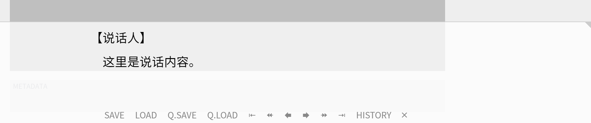{ loading=lazy .theme-review }

    ``` css
    :root {
        /* 对话框背景颜色，如果要设为透明请使用 transparent */
        --echo-live-bg-color: rgba(255, 255, 255, 0.75);
    }
    ```

=== "深色半透明"

    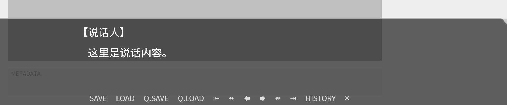{ loading=lazy .theme-review }

    ``` css
    :root {
        /* 对话框背景颜色，如果要设为透明请使用 transparent */
        --echo-live-bg-color: rgba(0, 0, 0, 0.6);
        /* 对话框顶部边框颜色、尺寸、线形，要禁用请设为 unset */
        --echo-live-border-top: rgba(255,255,255,0.5) 2px solid;

        /* 对话框正文内容颜色 */
        --echo-live-content-color: #FFF;
        /* 对话框说话人名字颜色 */
        --echo-live-username-color: #FFF;
        /* 对话框底部工具栏内容颜色 */
        --echo-live-bottom-color: #DDD;

        /* 对话框装饰角标颜色 */
        --corner-marker-color: rgba(255,255,255,0.5);
    }
    ```

#### 玻璃 | Glass

=== "湖泊蓝"

    { loading=lazy .theme-review }

    ``` css
    :root {
        /* 对话框底部工具栏内容颜色 */
        --echo-live-bottom-color: #FFF;
        /* 对话框渐变背景颜色 */
        --echo-live-bg-gradient-color: rgba(0, 50, 140, 0.75);
        /* 对话框底部工具栏渐变背景颜色 */
        --echo-live-bottom-bg-gradient-color: rgba(26, 98, 190, 1);
    }
    ```

=== "水晶紫"

    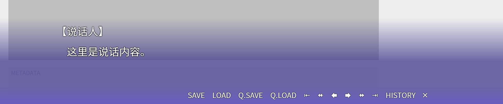{ loading=lazy .theme-review }

    ``` css
    :root {
        /* 对话框底部工具栏内容颜色 */
        --echo-live-bottom-color: #FFF;
        /* 对话框渐变背景颜色 */
        --echo-live-bg-gradient-color: rgba(65, 58, 140, 0.75);
        /* 对话框底部工具栏渐变背景颜色 */
        --echo-live-bottom-bg-gradient-color: rgba(103, 94, 191, 1);
    }
    ```

=== "蜜桃粉"

    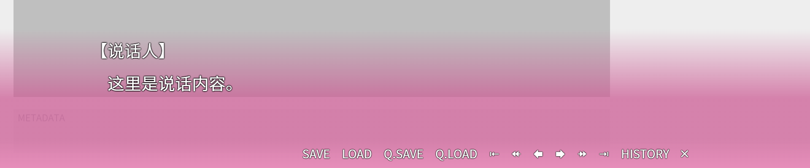{ loading=lazy .theme-review }

    ``` css
    :root {
        /* 对话框底部工具栏内容颜色 */
        --echo-live-bottom-color: #FFF;
        /* 对话框渐变背景颜色 */
        --echo-live-bg-gradient-color: rgba(204, 93, 149, 0.75);
        /* 对话框底部工具栏渐变背景颜色 */
        --echo-live-bottom-bg-gradient-color: rgba(230, 142, 186, 1);
    }
    ```

=== "葡萄红"

    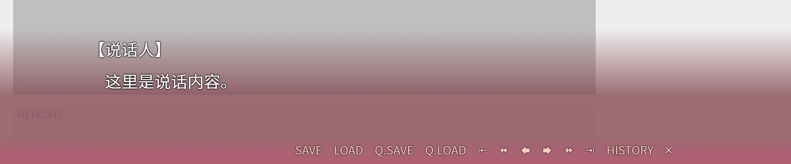{ loading=lazy .theme-review }

    ``` css
    :root {
        /* 对话框底部工具栏内容颜色 */
        --echo-live-bottom-color: #FFCCBF;
        /* 对话框渐变背景颜色 */
        --echo-live-bg-gradient-color: rgba(128, 63, 74, 0.75);
        /* 对话框底部工具栏渐变背景颜色 */
        --echo-live-bottom-bg-gradient-color: rgba(178, 94, 115, 1);
    }
    ```

=== "咖啡棕"

    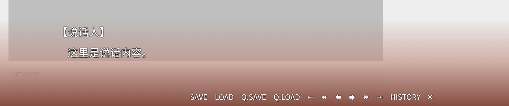{ loading=lazy .theme-review }

    ``` css
    :root {
        /* 对话框底部工具栏内容颜色 */
        --echo-live-bottom-color: #FFF;
        /* 对话框底部工具栏渐变背景颜色 */
        --echo-live-bottom-bg-gradient-color: transparent;
    }

    #echo-live {
        background-image: linear-gradient(to top, rgba(128, 70, 57, 0.95) 0%, rgba(191, 141, 129, 0.65) 50%, rgba(191, 141, 129, 0) 100%);
    }
    ```

### 历史记录

#### 原版 | Vanilla

=== "浅色半透明"

    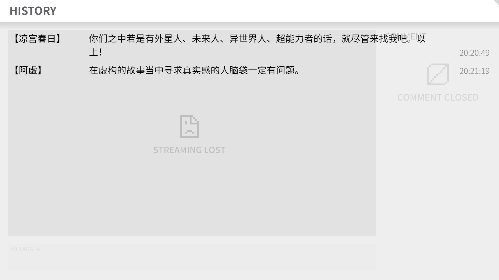{ loading=lazy .theme-review }

    ``` css
    :root {
        /* 历史记录背景颜色，如果要设为透明请使用 transparent */
        --echo-live-history-bg-color: rgba(238, 238, 238, 0.75);
    }
    ```

=== "深色半透明"

    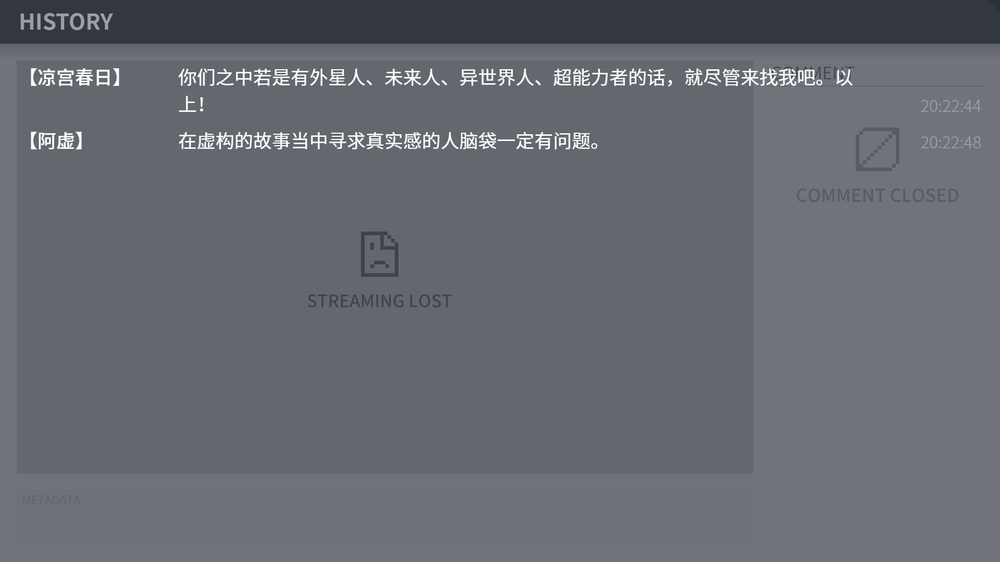{ loading=lazy .theme-review }

    ``` css
    :root {
        /* 历史记录背景颜色，如果要设为透明请使用 transparent */
        --echo-live-history-bg-color: rgba(69, 73, 82, 0.75);
        /* 历史记录标题背景颜色 */
        --echo-live-history-bg-color-title: #333740;
        /* 历史记录字体颜色 */
        --echo-live-history-color: #FFF;
        /* 历史记录标题字体颜色 */
        --echo-live-history-color-title: #9C9EA6;
        /* 历史记录发送时间字体颜色 */
        --echo-live-history-color-time: #9C9EA6;
    }
    ```

#### 玻璃 | Glass

=== "湖泊蓝"

    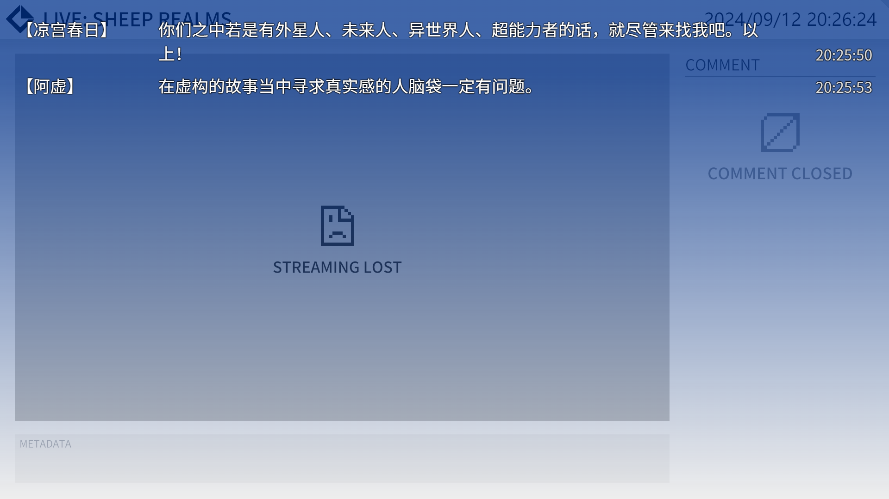{ loading=lazy .theme-review }

    ``` css
    :root {
        /* 历史记录渐变背景颜色 */
        --echo-live-history-bg-gradient-color: rgba(0, 50, 140, 0.75);
    }
    ```

=== "水晶紫"

    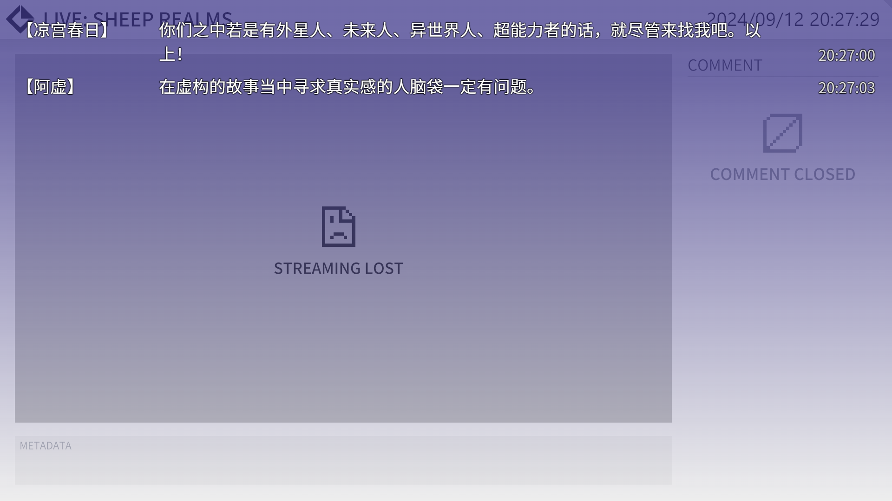{ loading=lazy .theme-review }

    ``` css
    :root {
        /* 历史记录渐变背景颜色 */
        --echo-live-history-bg-gradient-color: rgba(65, 58, 140, 0.75);
    }
    ```

=== "蜜桃粉"

    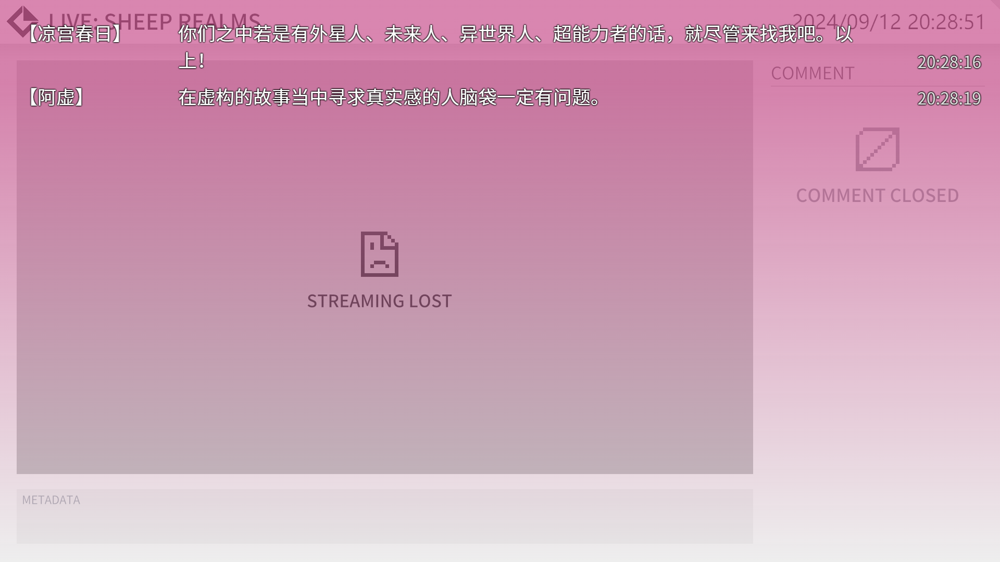{ loading=lazy .theme-review }

    ``` css
    :root {
        /* 历史记录渐变背景颜色 */
        --echo-live-history-bg-gradient-color: rgba(204, 93, 149, 0.75);
    }
    ```

=== "葡萄红"

    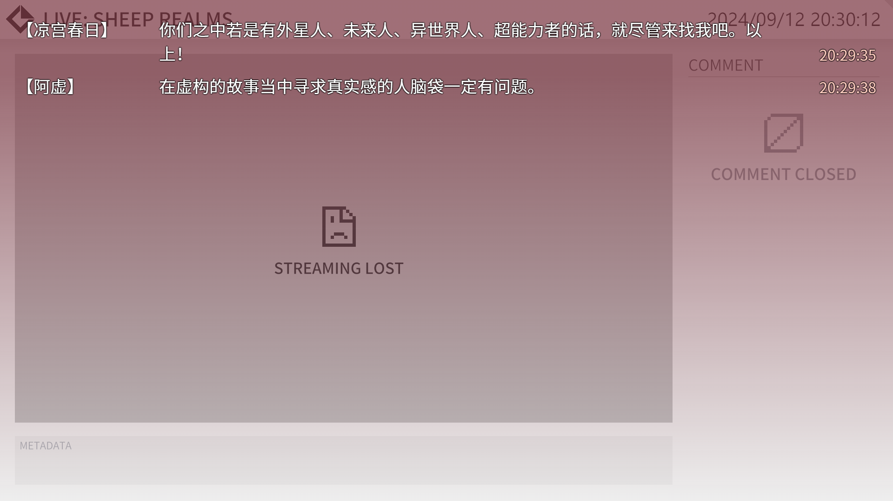{ loading=lazy .theme-review }

    ``` css
    :root {
        /* 历史记录渐变背景颜色 */
        --echo-live-history-bg-gradient-color: rgba(128, 63, 74, 0.75);
        /* 历史记录发送时间字体颜色 */
        --echo-live-history-color-time: #FFCCBF;
    }
    ```

=== "咖啡棕"

    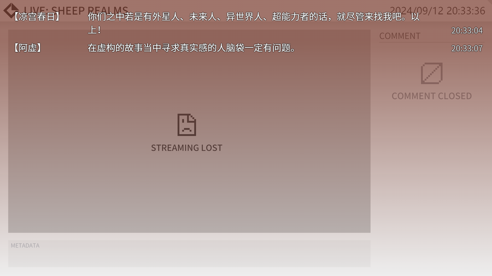{ loading=lazy .theme-review }

    ``` css
    :root {
        /* 历史记录渐变背景颜色 */
        --echo-live-history-bg-gradient-color: rgba(128, 70, 57, 0.75);
    }
    ```