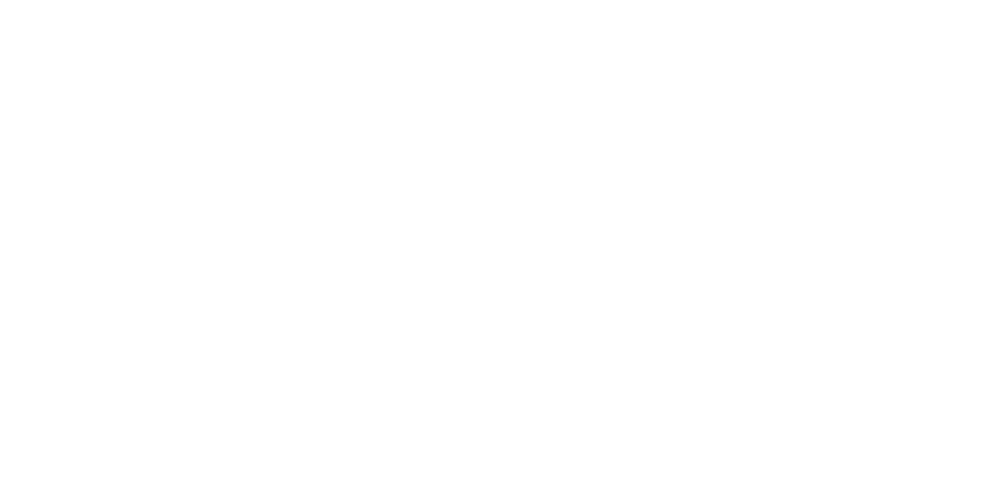

# 欢迎使用 Echo-Live

{ .only-light style="max-height: 40vh; display: block; margin: 0 auto; border-radius: 8px;" }
{ .only-dark style="max-height: 40vh; display: block; margin: 0 auto; border-radius: 8px;" }

[:fontawesome-brands-github: GitHub](https://github.com/sheep-realms/Echo-Live){ .md-button target="_blank" }
[:material-download: 下载](https://github.com/sheep-realms/Echo-Live/releases){ .md-button .md-button--primary target="_blank" }

Echo-Live 是一款基于 Echo 的用于无声系虚拟主播直播的仿视觉小说对话框 OBS 插件。

快速参考

!!! info "时效性问题提醒"

    Echo-Live 目前仍在不断开发新功能，本文档有时不能保证与 Echo-Live 一同更新，具有一定的滞后性。如果您在阅读本文档的过程中有感到困惑的地方，请直接与开发者联系。

-   :material-help-circle: **使用指南**

    ---

    了解如何在 OBS 中安装并使用 Echo-Live 及其编辑器。

    [:material-arrow-right: 开始使用](main/how-to-use.md)

-   :material-message-text: **消息格式**

    ---

    了解 Echo-Live 发送消息所使用的一种特定格式的数据。

    [:material-arrow-right: 了解详情](message/index.md)

-   :material-connection: **开发接口**

    ---

    Echo-Live 使用 WebSocket 作为开发接口对接到内部的广播系统。

    [:material-arrow-right: 了解详情](dev/broadcast/index.md)

-   :material-coffee: **交流互动**

    ---

    我们开设了一个 Discord 服务器方便用户交流和反馈问题，随时欢迎您加入。

    [:material-arrow-right: 加入 Discord 服务器](https://discord.gg/XuPQBw6tHC){ target="_blank" }

GitHub 仓库状态与统计

友情链接

- [:material-post-outline: 橘橘博客](https://nblog.nekoorange.cn/){ target="_blank" }
- [:fontawesome-brands-github: 祐星技术研究社](https://github.com/ElicaseTech){ target="_blank" }
- [:material-layers: 存档计划](https://lakeus.xyz/){ target="_blank" }
- [:material-numeric-9-circle-outline: BakaXL](https://www.bakaxl.com/){ target="_blank" }

