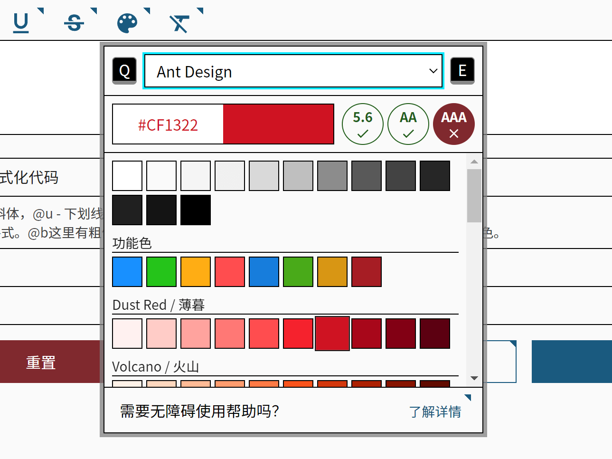

# 无障碍使用指南

!!! aria "欢迎阅读无障碍使用指南！"
    我们尊重每一位用户，尽可能满足所有用户的需求。我们对暂时无法满足需求的用户致以歉意，我们对所有人的崇高理想深表敬意。

## :material-account-voice: 讲述人适配 { id="voice" }

完成度：仍需改进。

Echo-Live 编辑器配置了一些 ARIA 属性，即无障碍富互联网应用（Accessible Rich Internet Applications）。我们已尽力改善视障人士的使用体验，但仍未达到我们预期的效果。我们对此没有任何经验，如果您可以提供帮助，欢迎联系我们改进。

## :material-keyboard: 键盘可访问 { id="keyboard" }

完成度：良好。

Echo-Live 编辑器是键盘可访问的，没有死区、不可达的交互元素。

使用 Alt + 数字键 组合键可以快速切换标签页。

## :material-palette: 色盲/色弱视觉调整 { id="visual" }

完成度：良好。

Echo-Live 编辑器中存在一些可能会使色盲/色弱人士无法辨别的元素，我们在配置文件 config.js 中提供了一些配置以解决这些问题，这些配置被放置在 accessible 配置项中，内容如下：

| 配置名称 | 描述 |
| - | - |
| high_contrast | 高对比度。 |
| drotanopia_and_deuteranopia | 红绿色盲。 |

您可以将这些配置值设为 true 以启用相关调整。另外，如果您的操作系统开启了高对比度，编辑器也会开启高对比度样式。

另外，Echo-Live 编辑器中的拾色器准备了丰富的颜色，这可能会对您造成困扰。如果您不清楚应该选用哪些颜色，请选择我们预先准备好的 Ant Design 色板，该色板提供了一些具有特定含义的功能色。鼠标悬停在色块上会显示颜色名称。

| 颜色名称 | 描述 |
| - | - |
| Link | 蓝色，常见于链接、一般消息提示的主题色，区别于普通文本颜色用于醒目提示，表达通常、通用、一般、普通。 |
| Success | 绿色，常见于成功提示，表达完成、成功、安全。 |
| Warning | 黄色，常见于警告提示，但重要性低于错误提示，表达警告、注意。一般文本中很少使用此颜色作为醒目提示。 |
| Error | 红色，常见于错误提示，表达错误、危险、失败、禁止。这是最高级别的警告色。 |

这些颜色后方还有颜色更深的 Dark 版本，如果您的对话框背景颜色是浅色，建议使用 Dark 版本。

此外，您还可以通过将配置文件中的 editor 中的 palette_color_contrast_enable 配置项设为 true 来开启对比度测试面板。测试基于 WCAG AA 和 WCAG AAA 标准，但对于视力正常的人来说 WCAG 标准其实有点严苛，因此我们经过反复测试，确定了 3.8 作为对比度测试阈值，将其作为第三项测试项目。您也可以通过配置文件自行修改此阈值。

