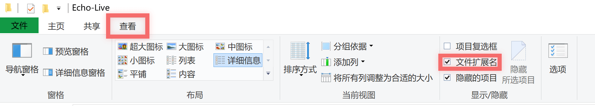
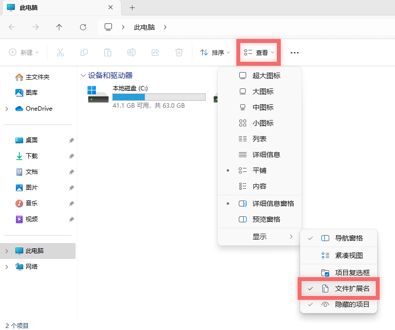
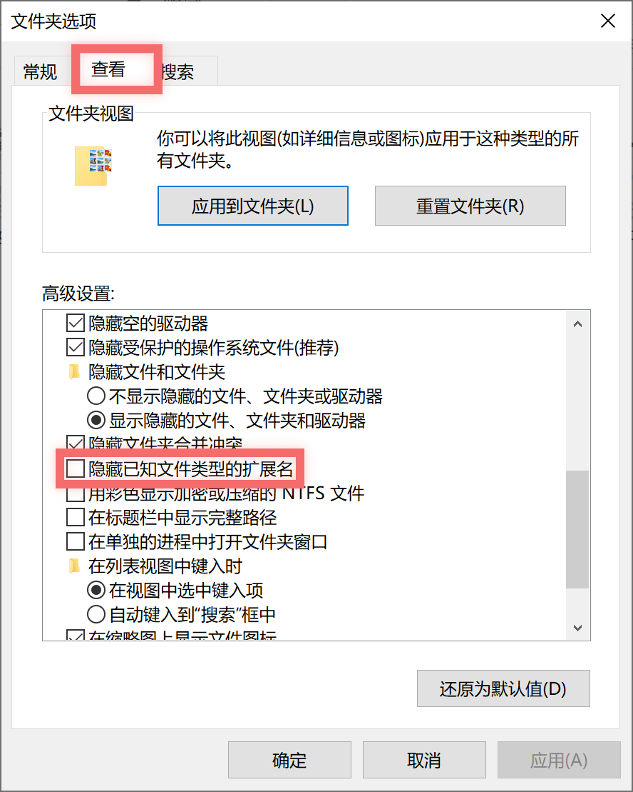
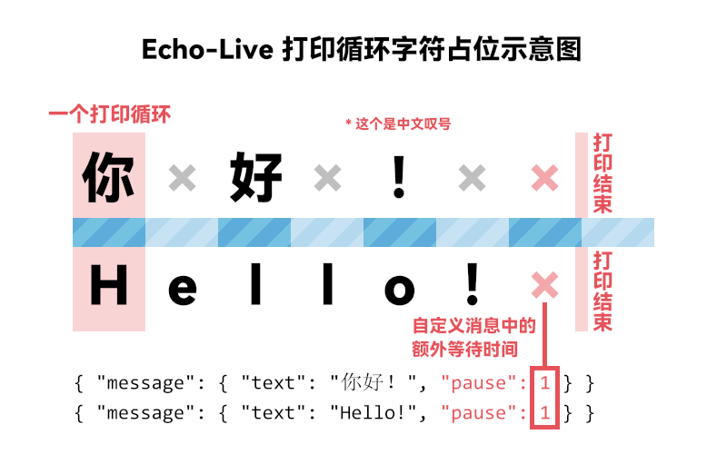

# 常见问题

## :material-alert-decagram: 重要问题

### :material-file-edit: 如何编辑文件内容？ { id="edit-file" }

如果您想要编辑 JS、CSS、HTML 等文件的内容，建议您使用专业的文本编辑器，例如 [VSCode](https://code.visualstudio.com/)、[Sublime Text](https://www.sublimetext.com/)。

**不 要 使 用 记 事 本！**

### :material-file-eye: 如何显示文件扩展名？ { id="file-extension" }

本文档默认您已开启文件扩展名显示，您可能会疑惑：

> `live.html`、`editor.html` 都是什么东西啊？我只看到了了 `live` 和 `editor`！

如果您有这样的疑惑，说明您没有开启文件扩展名显示。

请根据您的操作系统进行以下操作：

=== "Windows 10"

    打开文件资源管理器（桌面上的 “此电脑”），点击上方的 “查看” 菜单，找到 “显示/隐藏” 分组，勾选 “文件扩展名”。

    { .img-light-hyper }

=== "Windows 11"

    打开文件资源管理器（桌面上的 “此电脑”），点击上方的 “查看” 菜单，找到 “显示” 项目，在其二级菜单中勾选 “文件扩展名”。

    { .img-light-hyper style="max-height: 70vh;" }

=== "Windows 7"

    打开文件资源管理器（桌面上的 “计算机”），依次点击菜单栏中的 “工具”、“文件夹选项”。

    在弹出的 “文件夹选项” 窗口中，点击 “查看” 选项卡，在 “高级设置” 中**取消勾选** “隐藏已知文件类型的扩展名”，然后点击 “确定” 按钮。

    { .img-light-hyper style="max-height: 70vh;" }

=== "其他操作系统"

    抱歉我手里没有这样的系统，请您自己上网搜索教程。


## :material-pencil: 编辑器相关

### 如何编辑富文本消息？

目前暂不支持可视化富文本编辑。在广播模式下，您可以使用[快速格式化代码](../message/formatting-code.md)或在编辑器的 输出 > 输出内容 标签页中编辑自定义[消息格式](../message/index.md)代码并发送。

例如，您可以将以下代码粘贴到输出内容文本框中：

``` javascript linenums="1"
{
    "username": "【测试】",
    "messages": [
        {
            "message": "你好，世界！",
            "style": {
                "bold": true
            }
        }
    ]
}
```

点击下方的 “发送” 按钮，您将会在对话框中看到粗体的 “你好，世界！” 消息。如果格式错误，日志标签页中会显示醒目错误提示。

### 如何一次性发送多条消息？

这一般用于预先准备好的演出，请不要尝试在直播中即兴发挥，很麻烦的！

首先您需要准备好消息格式代码，请参考[消息队列](../message/message-list.md)。

在广播模式下，您可以在编辑器的 输出 > 输出内容 标签页中发送自定义消息，在输出内容文本框中粘贴您准备好的代码，点击 “发送” 按钮即可。

在轮询模式下，您需要编辑 [start.js](../message/index.md) 文件，替换其中的消息格式代码。

如果操作正确，您会在对话框中看到第一条消息。在 OBS 中选中对话框源，点击 “交互” 操作按钮，在弹出的浏览器窗口中点击对话框的任意位置即可显示下一条消息，直到所有消息都已显示。


## :material-message-text: 对话框相关

### 如何修改对话框加载时显示的第一条消息？

对话框显示的第一条消息由 [start.js](../message/index.md) 脚本文件定义，如果您想要让第一条消息为空，请直接将此文件全文内容替换为：

``` javascript linenums="1"
echolive.send({
    "username": "",
    "messages": [
        {
            "message": ""
        }
    ]
});
```

### 为什么半透明背景有一层淡灰色？

请在 OBS 选中对话框（包括历史记录在内的其他前台页面），右键，在弹出菜单中找到 “混合方式”，选择 “关闭 sRGB”。

### 如何设置讲述人的语音资源？

如果你不知道该怎么做，请留空此配置以使用系统默认值。

您可以在[配置文件编辑器](../custom/config.md#config-editor)中找到此配置，其文本框内容为空时会列出所有可用的值，部分浏览器可能需要多点一次文本框才能列出候选值。

不同的浏览器会出现不同的值，一些浏览器会提供独有的语音资源。例如，Chrome 浏览器会添加其提供的 Google 合成语音，这些语音资源不是系统内置的语音资源，不能在 OBS 中使用。虽然 OBS 浏览器是 Chrome 内核，但并没有这些语音资源。您应当确保所选择的语音资源来自于系统，例如在 Windows 操作系统中您可以找到诸如 “Microsoft Huihui”、“Microsoft Yaoyao” 等语音资源，这些语音资源是可以在 OBS 中正常使用的。

语音资源能否正确使用最终取决于前台页面所在的浏览器环境。如果所选择的语音资源不可用，则会以系统默认语音替代。

### 什么是打印循环？ { id="print-loop" }

打印循环指的是对话框在进行逐字输出动画时，每输出一个字的过程。在默认配置中，一个打印循环耗时 30 毫秒。通常情况下，一个字符占用一个打印循环，而中日韩统一表意文字占用两个打印循环。

{ .img-light-hyper }

在消息格式中，[停顿](../message/pause.md)指的就是停顿多少个打印循环。