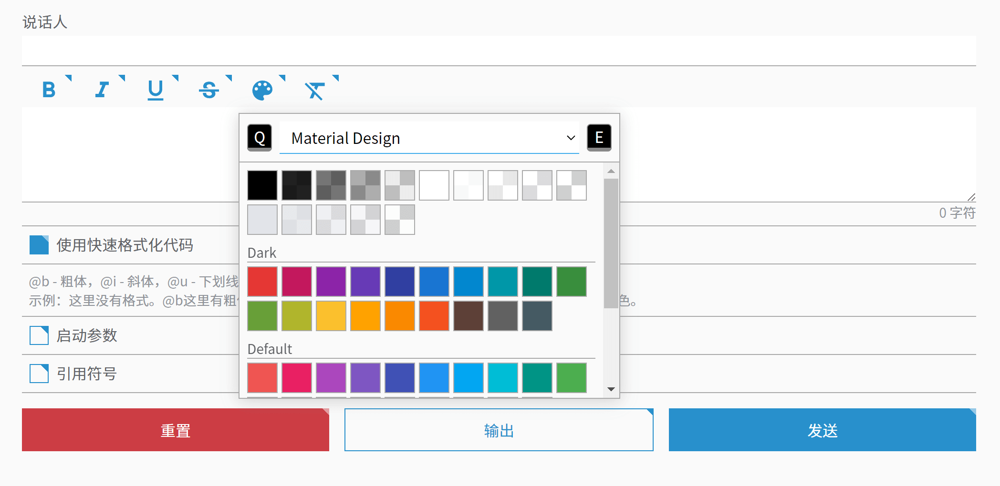
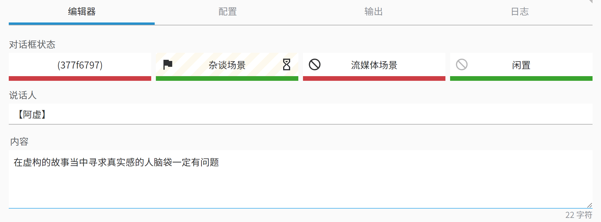
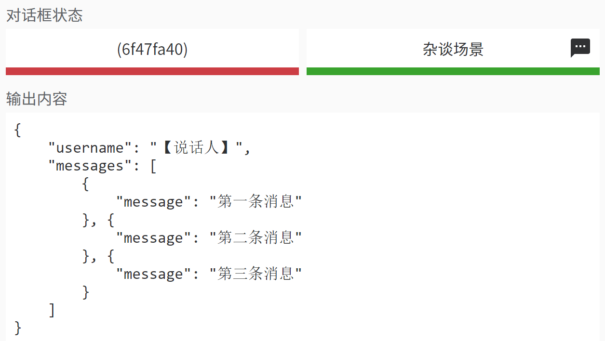
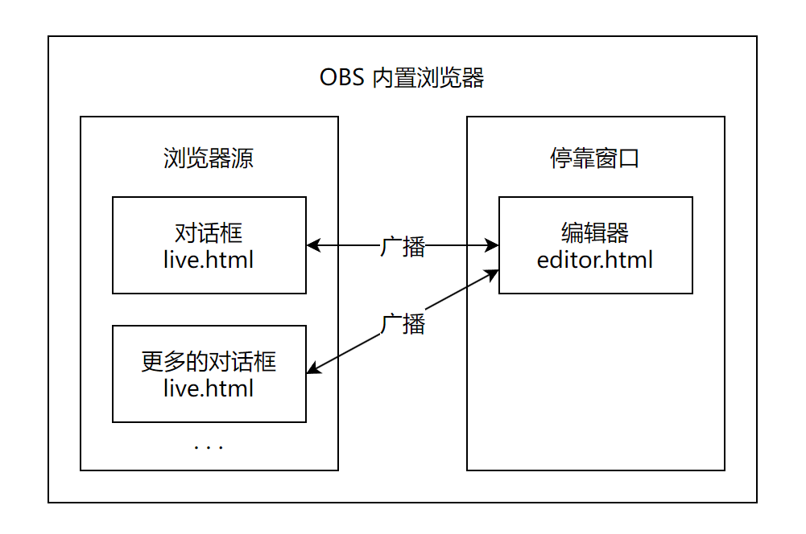
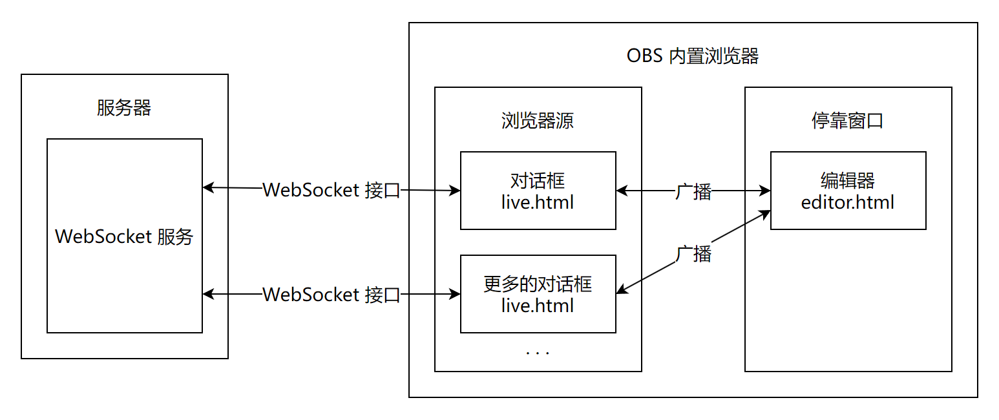
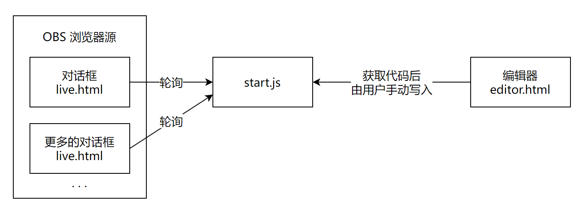

# 如何使用 Echo-Live

Echo-Live 无需运行安装程序，开箱即用。

<p style="color: var(--md-default-fg-color--light);">不过在开始使用之前，您最好将其放置在一个合适的位置。</p>

<p style="color: var(--md-default-fg-color--lighter);">我的意思是，您最好别把它放在 “桌面”、“下载” 等类似的文件夹中，虽然这不影响使用，但可能影响您在 OBS 里添加源的速度以及不利于文件管理维护。</p>

**等一下！** 如果您还没有在资源管理器中打开显示文件扩展名，请[打开显示文件扩展名](faq.md#file-extension)。

## :material-sign-direction: 使用方法
### 方法一：通过 OBS 内置浏览器广播传递消息（推荐）
1. 打开 OBS，将 `live.html` 作为浏览器源 **（不要勾选 “本地文件”）** 添加到您的场景中。如果您不知道如何正确填写地址，请直接使用浏览器打开 `live.html`，然后复制地址栏里的地址。
2. 点击 OBS 菜单中的 停靠窗口 > 自定义浏览器停靠窗口，将 `editor.html` 添加到停靠窗口中。如果您不知道如何正确填写地址，同上。
3. 在弹出的编辑窗口中，根据指引填写对话数据，点击 “发送”。（注：如果您关闭了广播功能则不会有发送按钮）
4. 若要继续制作下一条对话，重复步骤 3。

注：如需修改启动后的初始消息，请编辑文件 `start.js`。

??? warning "Linux 用户请注意"
    截至 OBS 官方为 Linux 发行的 30.0 版本，OBS 未提供浏览器源、自定义停靠窗口的功能，因此该方法不可用。

### 方法二：通过轮询传递消息
如果因 OBS 更新等原因导致上述方法失效，请尝试此方法。

1. 在浏览器中打开 `settings.html`，这是配置文件编辑器。点击 “编辑” 标签页，选择 “Echo-Live” 选项，将 “启用广播” 关闭，将 “启用消息轮询” 打开。然后选择 “编辑器” 选项，将 “启用在输出内容前插入内容” 和 “启用在输出内容后插入内容” 打开。最后点击底部的 “保存” 按钮保存配置文件。配置文件是 Echo-Live 根目录中的 `config.js`，用编辑后的配置文件覆盖它。
2. 打开 OBS，将 `live.html` 作为浏览器源（勾选 “本地文件”）添加到您的场景中。
3. 使用文本编辑器打开 `start.js` 备用。建议您使用 [VSCode](https://code.visualstudio.com/) 等专业文本编辑器作为您的文本编辑器，不建议使用 Windows 内置的记事本。
4. 在浏览器中打开 `editor.html`，根据网页指引生成对话数据并复制。
5. 将 `start.js` 中的内容全部替换成复制的内容并保存。
6. 对话框将会自动打印修改后的消息。如果没有启用消息轮询，则需手动在 OBS 中选中浏览器源，点击 “刷新”。如果您自定义了一串消息列表，点击 “交互”，在弹出的窗口中点击任意内容区域即可开始打印下一条消息。
7. 若要继续制作下一条对话，重复步骤 3 ~ 5。当您熟悉语法格式后，您也可以直接编辑 `start.js`。


## :material-alert: 注意事项
- `config.js` 是配置文件，您可以在[配置文件编辑器](../custom/config.md#config-editor)中更改配置。
- 富文本不适合快节奏的直播活动，更适合用作预先准备好的演出。
- 您可能需要准备足够大的屏幕或副屏以获得更方便的操作体验。
- 在浏览器中预览效果时，一些浏览器的自动播放音频政策会导致您在未点击网页的情况下听不到打字音效，这是正常现象，OBS 内置浏览器无此限制。
- 请注意控制每一段话的字数，否则会溢出。
- 对话框网页不可见时会进入休眠状态以防止意料之外的演出，此机制可以在配置中关闭，但不建议你这么做。

## :material-pencil: 如何使用编辑器
### 编辑器
此标签页用于发送消息。

点击 “输出” 按钮可跳转至输出标签页输出一串用于发送消息的代码。

当您勾选了 “使用快速格式化代码” 后，您可以使用[快速格式化代码](../message/formatting-code.md)为文本添加样式，同时编辑器中会出现格式化控制器，用于快速在光标处或选中文本两侧插入代码。点击控制器上的文本颜色按钮会弹出拾色器悬浮框，拾色器最上方是色板下拉选单，我们准备了多套精心设计的配色方案（除了 “Minecraft” 色板，您最好谨慎使用），您可以在此切换不同的色板。如果您对颜色的使用有困扰，请见[无障碍使用指南 § 色盲/色弱视觉调整](accessible.md#visual)。

<figure markdown>
  { .img-light-hyper }
  <figcaption>勾选 “使用快速格式化代码” 后的编辑器</figcaption>
</figure>

如果您启用了广播模式，则会出现 “发送” 按钮，点击即可直接发送消息。

### 配置
此处用于配置输出代码时头尾插入的内容。如果您不知道这是什么请不要动它。

### 输出
此处用于输出代码。

如果您启用了广播模式，则会出现 “发送” 按钮，点击即可直接发送消息。您可以在这里编辑自定义消息直接发送。默认接受[消息格式](../message/index.md)数据，如果头尾包含配置中插入的内容则会先去除头尾再以消息格式数据处理。

### 日志
输出 Echo-Live 运行日志，只有启用广播模式的情况下才有日志显示。

### 对话框状态仪表板

对话框状态仪表板默认禁用，可以在配置中启用，只有在广播模式下才能生效。如果你在 OBS 中添加了多个对话框，建议启用。

对话框状态仪表板可以监控对话框运行状态，底部的颜色指示条表示对话框是否处于休眠状态，绿色为激活，红色为休眠。如果您有视觉障碍，请见[无障碍使用指南 § 色盲/色弱视觉调整](accessible.md#visual)。

{ .img-light-hyper }

当对话框正在打印消息时，仪表板上对应的方块会显示 :material-timer-sand: 沙漏图标。

如果对话框收到了多条消息并且至少有一条消息未打印，将会在空闲时显示 :material-message-processing: 气泡图标。此时点击对应的方块即可打印下一条消息。

{ .img-light-hyper }

也许您已经发现了，对话框可以被命名，并且在仪表盘中显示自定义名称。想要自定义对话框名称，请打开 OBS 中对话框源的设置，在地址后方添加以下参数：

```
?name=自定义名称
```

假如您的对话框文件位于 `D:/Echo-Live/live.html`，那么完整的地址应该是：

```
file:///D:/Echo-Live/live.html?name=自定义名称
```

当然，如果您使用的是 Linux 系统，那么地址也许是这样的：

```
file:///home/root/Echo-Live/live.html?name=自定义名称
```

保存设置后刷新源即可生效。

## :material-cog-box: 如何使用配置文件编辑器

参阅[配置 § 使用配置文件编辑器](../custom/config.md#config-editor)。

## :material-history: 如何使用历史记录

历史记录是一个面向观众展示历史对话消息的页面，于 1.3.0 版本加入，位于 Echo-Live 根目录中的 `history.html`。

1. 要使用历史记录，首先必须打开广播模式才能使其正常工作。
2. 打开 OBS，将 `history.html` 作为浏览器源 **（不要勾选 “本地文件”）** 添加到您的场景中。如果您不知道如何正确填写地址，请直接使用浏览器打开 `history.html`，然后复制地址栏里的地址。
3. 如果您已完成了上文中描述的广播模式下应该做的准备工作，那么历史记录可以开始使用了。

## :material-link: 如何使用 URL 参数

部分页面支持传递 URL 参数，以单独实现特定效果。

如果您不知道什么是 URL 参数，请参阅 MDN 上的《[什么是 URL？](https://developer.mozilla.org/zh-CN/docs/Learn/Common_questions/Web_mechanics/What_is_a_URL#%E5%8F%82%E6%95%B0){ target="_blank" }》。本文简而言之：URL 地址中可以传递一些参数，包含参数名（键）和参数值，以问号 `?` 作为参数列表的开始，以 `&` 符号分隔的键/值对列表。如下所示：

```
http://example.com/hello.html?参数名=参数值
http://example.com/hello.html?参数名=参数值&另一个参数名=另一个参数值
```

例如，您可以为某个对话框单独设置主题为 `void`，您在 OBS 中应当为对应的浏览器源的 URL 设置为如下内容：

```
file:///D:/Echo-Live/live.html?theme=void
```

其中，`theme` 就是参数名，在这里表示指定主题。前面的地址是 `live.html` 这个文件在您的设备中的地址，请根据实际情况修改。

其他可用的参数名请见下表：

| 参数名 | 描述 | 可用范围 |
| - | - | - |
| `name` | 对话框的识别名。 | 对话框（`live.html`） |
| `theme` | 设置主题。可用的主题请见[主题列表](../custom/theme.md#theme-list)。 | 所有前台页面 |

## :material-cog: 工作模式
### :material-broadcast: 广播模式
广播模式是一种基于浏览器内网页之间的通信技术实现的工作模式，由编辑器发送广播消息，对话框接收消息。该工作模式要求对话框和编辑器都在 OBS 的环境内。

<figure markdown>
  { .img-light-hyper }
  <figcaption>广播模式工作原理</figcaption>
</figure>

广播模式下可以开启 WebSocket 连接，第三方软件可以通过 WebSocket 接口向 Echo-Live 发送消息。

<figure markdown>
  { .img-light-hyper }
  <figcaption>WebSocket 工作原理</figcaption>
</figure>

### :material-sync: 轮询模式
轮询模式是备用方案，由对话框主动定时查询 `start.js` 是否发生更改，如果发生更改则输出新消息。启用广播模式将会禁用该模式。

<figure markdown>
  { .img-light-hyper }
  <figcaption>轮询模式工作原理</figcaption>
</figure>

### :material-island: 孤立模式

<p class="color-red">孤立模式在当前版本中已无法保证按预期工作，如无特殊需求请不要使用此模式。</p>

当以上两种模式均未启用时将会进入孤立模式。在此模式下，一旦 Echo-Live 播放完了所有消息，生命周期便到此为止，再次使用需要刷新浏览器。