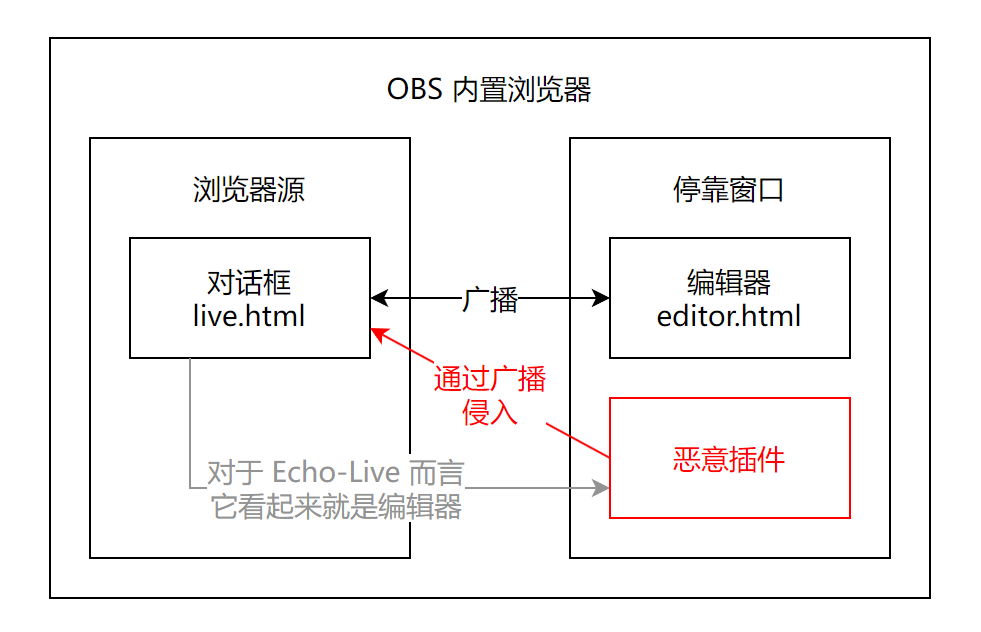

# 安全须知

!!! warning "注意"
    为了预防可能存在的安全隐患，请您务必仔细阅读此安全须知。虽然下文所描述的风险据我们所知从未发生过类似事件，但是防人之心不可无，养成良好的计算机安全意识对于我们每个人（尤其是网络主播等面向公众的职业）尤为重要。

## :material-ruler: 基本准则 { id="basic" }

1. 不要下载安装来路不明、不可信的软件，尽可能从正规渠道下载正版软件，尽可能从有安全保障的平台下载软件。
2. 不要轻信并执行他人发来的代码、可执行文件。
3. 始终保持谨慎，不要让自己没有任何防备。
4. 如果您是主播，请为您的直播设置足够的延迟以便您可以及时切断直播。事故发生时，除了本地切断直播以外，不要忘了前往直播平台停止直播。

## :material-fast-forward: 太长不看 { id="skip" }

1. 看完上面的内容。
2. 如果您确定没有任何软件有意影响、修改 Echo-Live，可以到此为止，否则请您接着看。

## :material-puzzle: Echo-Live 扩展 { id="extension" }

Echo-Live 的扩展仅作规范导入分享资源之用，虽然目前仅支持增加额外音频资源和主题，但实际上可以被用来做任何事，因此请不要安装来路不明的扩展。

## :material-tshirt-crew: Echo-Live 主题 { id="theme" }

Echo-Live 可以导入自定义主题，也可以通过扩展导入主题。需要注意的是，主题所使用的 CSS 文件并不安全，攻击者可以通过嵌入远程地址来获取您的 IP、浏览器与设备信息。这通常不会造成危害，除非这些攻击是专门为您定制的。

### :material-script-text: 主题脚本 { id="theme-script" }

一些主题为了实现丰富有趣的效果可能需要启用主题脚本，主题脚本需要通过 `echolive.live_theme_script_enable` 配置项开启。主题脚本中可以执行任意代码，攻击者可以轻而易举地发动攻击。

请开发者注意：如果您提供的主题需要启用脚本，请务必说明您不得不这么做的原因。

请用户注意：如果您使用的主题要求您启用脚本而未说明理由，非常不推荐您照做。

综上所述，请不要下载来源不明的主题。

## :material-broadcast: Echo-Live 广播 { id="echo-live-broadcast" }

Echo-Live 中的广播是一种浏览器内网页之间的通信技术，利用此技术可以实现在 OBS 的自定义浏览器停靠窗口向场景中的浏览器源发送数据的功能。

### :material-access-point-network: 第三方劫持广播 { id="broadcast-hijack" }

在广播模式下，如果您将第三方软件使用和 Echo-Live 类似的方法安装进了 OBS（也包括从浏览器源进入 OBS），第三方软件可以轻而易举地加入广播频道。在这种情况下，恶意软件有可能会发送恶意消息，可能给您造成恶劣影响。

<figure markdown>
  { .img-light-hyper }
  <figcaption>广播劫持攻击原理</figcaption>
</figure>

如果您遇到了这样的问题，请不要慌乱。如果您正在直播，请您立即切断直播（并且丢弃延迟）。Echo-Live 编辑器中的 “日志” 标签页会记录广播频道中的活动，您可以借此判断哪些活动是您本人产生的，哪些不是您本人产生的。如果确认存在恶意软件，请立即将所有 OBS 插件（包括 Echo-Live）移除，并将此事汇报给我们（见下文 “安全政策”）。

如果您担心发生以上问题，您可以修改配置文件中的 `echolive.broadcast_channel` 配置项，这是广播频道的名称，默认为 `sheep-realms:echolive`，您可以将其改为其他名称。不过恶意软件仍可以通过读取配置文件获取频道名称，甚至直接修改 Echo-Live 的源代码，而我们对此没有任何应对办法。因此，请您养成良好的安全意识非常重要。

### :material-connection: WebSocket 接口 { id="websocket" }

Echo-Live 提供了一些 API（应用程序编程接口）以方便开发者在不阅读 Echo-Live 源码的情况下进行二次开发。为了方便其他软件接入 API，Echo-Live 提供了 WebSocket 接口，这是一项网页与服务器之间建立长连接的通信技术。

一些第三方软件可能需要在您的设备上建立本地服务器以便于和 Echo-Live 通信，并且通常需要您配置 WebSocket 地址，即修改配置文件中的 `echolive.websocket_url` 配置项。通常情况下，协议头是 `ws://`，连接地址是：

- `localhost` 或 `127.0.0.1`，即本地。有时会有端口号，如 `127.0.0.1:3000`。
- 如果需要通过局域网连接，地址通常是 `192.168.X.X`。

如果连接地址不是上述地址，则可能是一个远程地址，服务器并没有运行在您可以掌控的设备上，一般情况下没有这么做的必要，请务必和第三方软件的开发者确认这么做的理由。

WebSocket 接口直接对接 Echo-Live 广播，上一小节中提到的风险同样存在。由于 WebSocket 接口是直接连接，因此您修改频道名称不会有任何影响。

### :material-test-tube: 实验性 API { id="experimental-api" }

实验性 API 需要通过 `echolive.experimental_api_enable` 配置项开启，默认关闭。

实验性 API 包含了一些危险操作，实现一些特殊功能可能是必要的，但如果使用不当可能会造成如下严重后果：

- Echo-Live 无法正常使用。
- 对话框内容渲染故障。
- 远程脚本注入，远程执行任意代码。

请开发者注意：如果您提供的产品需要启用实验性 API，请务必说明您不得不这么做的原因。

请用户注意：如果您使用的第三方软件要求您启用实验性 API 而未说明理由，非常不推荐您照做。

## :material-security: 安全政策 { id="security" }

如果您需要汇报安全问题，请阅读我们的[安全政策](https://github.com/sheep-realms/Echo-Live/security){ target="_blank" }。